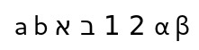
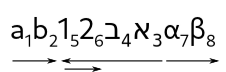
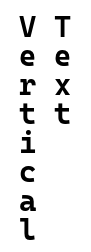

# Bidirectional Text

Pango supports bidirectional text (like Arabic and Hebrew) automatically.
Some applications however, need some help to correctly handle bidirectional text.

The [enum@Pango.Direction] type can be used with [method@Pango.Context.set_base_dir]
to instruct Pango about direction of text, though in most cases Pango detects
that correctly and automatically. For application that need more direct
control over bidirectional setting of text, Pango provides APIs such as
[func@unichar_direction], [func@find_base_dir], [func@get_mirror_char]
or [func@Pango.BidiType.for_unichar].

Here is an example for mixed-direction text (shown in logical order):

<picture>
  <source srcset="bidi-input-dark.png" media="(prefers-color-scheme: dark)">
  
</picture>

(the text to copy is: abאב12αβ )

Pango reorders the text according to the direction of the runs:

<picture>
  <source srcset="bidi-annotate-dark.png" media="(prefers-color-scheme: dark)">
  
</picture>

# Vertical Text

Pango is not only capable of vertical text layout, it can handle mixed vertical
and non-vertical text correctly. This section describes the types used for setting
vertical text parameters.

<picture>
  <source srcset="vertical-dark.png" media="(prefers-color-scheme: dark)">
  
</picture>
The way this is implemented is through the concept of *gravity*. Gravity tells glyphs which way is down, so the gravity of normal Latin text is south. A gravity value of east means that glyphs will be rotated ninety degrees
counterclockwise. So, to render vertical text one needs
to set the gravity and rotate the layout using the matrix machinery already
in place. This has the huge advantage that most algorithms working on a
[class@Pango.Layout] do not need any change as the assumption that lines run
in the X direction and stack in the Y direction holds even for vertical text
layouts.

Here is an example for some English text rendered with gravity west, rotated 90 degrees:

Applications should only need to set base gravity on [class@Pango.Context] in use,
and let Pango decide the gravity assigned to each run of text. This automatically
handles text with mixed scripts. A very common use is to set the context base
gravity to auto using [method@Pango.Context.set_base_gravity] and rotate the layout
normally. Pango will make sure that Asian languages take the right form, while
other scripts are rotated normally.

The correct way to set gravity on a layout is to set it on the context associated
with it using [method@Pango.Context.set_base_gravity]. The context of a layout can
be accessed using [method@Pango.Layout.get_context]. The currently set base gravity
of the context can be accessed using [method@Pango.Context.get_base_gravity] and the
*resolved* gravity of it using [method@Pango.Context.get_gravity]. The resolved
gravity is the same as the base gravity for the most part, except that if the base
gravity is set to `PANGO_GRAVITY_AUTO`, the resolved gravity will depend on the
current matrix set on context, and is derived using [func@Pango.Gravity.get_for_matrix].

The next thing an application may want to set on the context is the *gravity hint*.
A [enum@Pango.GravityHint] instructs how different scripts should react to the set
base gravity.

Font descriptions have a gravity property too, that can be set using
[method@Pango.FontDescription.set_gravity] and accessed using
[method@Pango.FontDescription.get_gravity]. However, those are rarely useful
from application code and are mainly used by `PangoLayout` internally.

Last but not least, one can create `PangoAttributes` for gravity and gravity
hint using [func@attr_gravity_new] and [func@attr_gravity_hint_new].
