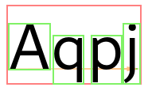

# Fonts

Pango supports a flexible architecture where a particular rendering architecture
can supply an implementation of fonts. The `PangoFont` structure represents an
abstract rendering-system-independent font. Pango provides routines to list
available fonts, and to load a font matching a given description.

Conceptually, Pango groups fonts into faces and families which are identified
by a name. A *font face* provides the different sizes of a single font style.
A *font family* provides the available styles of a font.

As an example, "Helvetica" is a family, "Helvetica Bold" is a face of this
family, and "Helvetica Bold 12pt" is a concrete font of this face.

# Font Enumeration

The central object for dealing with the available fonts on a system and caching
loaded fonts is a [class@Pango.FontMap]. An application typically uses a single
font map.

Since the font map depends on the rendering architecture in use, you'll need to
use the backend function pango_cairo_font_map_get_default() to obtain the default
fontmap. Depending on the platform, it will return a `PangoCairoFcFontMap`, a
`PangoCairoWin32FontMap` or a `PangoCairoCoreTextFontMap`.

Once you have a fontmap, you can enumerate the available font families with
[method@Pango.FontMap.list_families]. To enumerate the faces of a font family,
use [method@Pango.FontFamily.list_faces].

# Font Descriptions

Since loading fonts uses system resources, Pango provides a way to describe
a font without loading it. A [struct@Pango.FontDescription] is a struct that
contains enough information to load a concrete font with
[method@Pango.FontMap.load_font] or [method@Pango.Context.load_font]. You can
obtain a font description from a font face using [method@Pango.FontFace.describe],
or by parsing a string such as

    Helvetica Bold 12pt

with [func@Pango.FontDescription.from_string].

# Glyphs

A font provides information about glyphs and how to position and render them.
The Pango rendering pipeline uses this information to create a
[struct@Pango.GlyphString], which contains the glyphs corresponding to the
characters in the text and related information such as glyph positions and sizes,
and clustering information (i.e. which glyphs correspond to which characters).

A glyph is identified by a [alias@Pango.Glyph], which is a numeric ID. Note that
glyph IDs are font-specific: the same character can be represented by diffferent
glyph IDs in different fonts.

The mapping between characters and glyphs is in general neither 1-1 nor a map:
a single glyph may represent multiple characters (as is the case with ligatures),
a single character may be represented by multiple glyphs (for example, when
combining accents and base character), and in complex scripts, multiple characters
may form clusters that get rearranged and represented by multiple glyphs.
