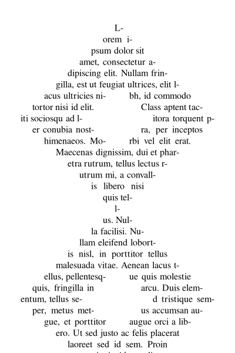

# Complex layout

The central object in high-level Pango API is [class@Pango2.Layout].
It is well-suited for breaking text into lines that fill a rectangular
area, since that is commonly how paragraphs are formatted in books.
But in real-life situations, text does not always fit in a box.
Examples of more complicated requirements are fitting text around
an image, or flowing text between multiple frames.

For cases like these, it is better to use [class@Pango2.LineBreaker]
directly instead of `Pango2Layout` (`Pango2Layout` is using a line
breaker internally). The way `Pango2LineBreaker` works is to let
applications access the formatted result one line at a time, place
it, and change parameters such as the line width before requesting
the next one.

The following example shows how to use `Pango2LineBreaker` to
produce an unusually shaped paragraph with a hole in the middle.

## Using Pango2LineBreaker

```
#include <pango2/pangocairo.h>

static Pango2Lines *
format_text (const char *text)
{
  Pango2Context *context;
  Pango2LineBreaker *breaker;
  Pango2Lines *lines;
  int x, y, width;
  int inc, m, w, w2;

  context = pango2_context_new ();
  breaker = pango2_line_breaker_new (context);

  pango2_line_breaker_add_text (breaker, text, -1, NULL);

  lines = pango2_lines_new ();

  m = 200;
  w = 10;
  w2 = -200;
  inc = 40;

  y = 40 * PANGO2_SCALE;
  x = (m - w / 2) * PANGO2_SCALE;
  width = w * PANGO2_SCALE;

  while (pango2_line_breaker_has_line (breaker))
    {
      Pango2Line *line;
      Pango2Rectangle ext;
      gboolean ltr;

      line = pango2_line_breaker_next_line (breaker,
                                           x, width,
                                           PANGO2_WRAP_CHAR,
                                           PANGO2_ELLIPSIZE_NONE);

      pango2_line_get_extents (line, NULL, &ext);
      line = pango2_line_justify (line, width);
      pango2_lines_add_line (lines, line, x, y - ext.y);

      ltr = pango2_line_breaker_get_direction (breaker) == PANGO2_DIRECTION_LTR;

      if (w2 > 0 && ltr && x <= m * PANGO2_SCALE)
        x = (m + w2 / 2) * PANGO2_SCALE;
      else if (w2 > 0 && !ltr && x > m * PANGO2_SCALE)
        x = (m - w2 / 2) * PANGO2_SCALE;
      else
        {
          y += ext.height;

          w += inc;
          w2 += inc;
          if (w + inc >= 340 || w + inc < 0)
            inc = - inc;

          if (w2 > 0)
            width = ((w - w2) / 2) * PANGO2_SCALE;
          else
            width = w * PANGO2_SCALE;

          if (ltr)
            x = (m - w / 2) * PANGO2_SCALE;
          else
            x = (m + w / 2) * PANGO2_SCALE;
        }
    }

  g_object_unref (breaker);
  g_object_unref (context);

  return lines;
}

static void
draw_lines (cairo_t *cr, Pango2Lines *lines)
{
  for (int i = 0; i < pango2_lines_get_line_count (lines); i++)
    {
      Pango2Line *line = pango2_lines_get_lines (lines)[i];
      int x, y;

      pango2_lines_get_line_position (lines, i, &x, &y);

      cairo_save (cr);
      cairo_move_to (cr, x / (double)PANGO2_SCALE, y / (double)PANGO2_SCALE);
      pango2_cairo_show_line (cr, line);
      cairo_restore (cr);
    }
}

int
main (int argc, char *argv[])
{
  const char *filename;
  Pango2Lines *lines;
  cairo_surface_t *surface;
  cairo_t *cr;
  char *text;
  gsize length;
  GError *error = NULL;
  cairo_status_t status;

  if (argc != 3)
    {
      g_printerr ("Usage: %s INPUT_FILENAME OUTPUT_FILENAME\n", argv[0]);
      return 1;
    }

  if (!g_file_get_contents (argv[1], &text, &length, &error))
    {
      g_printerr ("%s\n", error->message);
      return 1;
    }

  filename = argv[2];

  surface = cairo_image_surface_create (CAIRO_FORMAT_ARGB32, 400, 600);
  cr = cairo_create (surface);
  cairo_set_source_rgb (cr, 1, 1, 1);
  cairo_paint (cr);
  cairo_set_source_rgb (cr, 0, 0, 0);

  lines = format_text (text);
  draw_lines (cr, lines);
  g_object_unref (lines);

#ifdef CAIRO_HAS_PNG_FUNCTIONS
  status = cairo_surface_write_to_png (surface, filename);
#else
  status = CAIRO_STATUS_PNG_ERROR; /* Not technically correct, but... */
#endif

  if (status != CAIRO_STATUS_SUCCESS)
    g_printerr ("Could not save png to '%s'\n", filename);
  else
    g_print ("Output written to %s\n", filename);

  cairo_surface_destroy (surface);
  cairo_destroy (cr);

  return 0;
}
```

Once you build and run the example code above, you should see the
following result:


