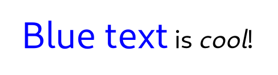
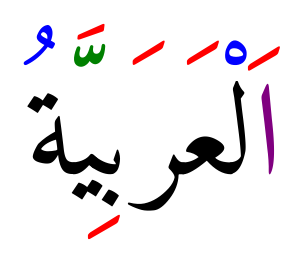

# Text Attributes

Attributed text is used in a number of places in Pango. It is used as the
input to the itemization process and also when creating a [class@Pango.Layout].

Attributes can influence the various stages of the rendering pipeline. For example,
font or size attributes will influence the font selection that is happening during
itemization, font features and letterspacing attributes will influence shaping, and
color or underline attributes will be used for rendering.

Pango uses a simple structs for individual attributes, such as
[struct@Pango.AttrColor] or [struct@Pango.AttrFontDesc]. Each attribute has a type,
and a start and end index that determine the range of characters that the attribute
applies to. See the [enum@Pango.AttrType] enumeration for all the possible
attribute types.

Attributes rarely come alone. Pango uses the [struct@Pango.AttrList] structure
to hold all attributes that apply to a piece of text.

# Pango Markup

Frequently, you want to display some text to the user with attributes applied to
part of the text (for example, you might want bold or italicized words). With the
base Pango interfaces, you could create a [struct@Pango.AttrList] and apply it to
the text; the problem is that you'd need to apply attributes to some numeric range
of characters, for example "characters 12-17." This is broken from an
internationalization standpoint; once the text is translated, the word you wanted
to italicize could be in a different position.

The solution is to include the text attributes in the string to be translated.
Pango provides this feature with a small markup language. You can parse a marked-up
string into the string text plus a [struct@Pango.AttrList] using either of
[func@parse_markup] or [func@markup_parser_new].

A simple example of a marked-up string might be:

```
<span foreground="blue" size="x-large">Blue text</span> is <i>cool</i>!
```



A more elaborate example of using markup to color combining marks in
Arabic text:

```
<span foreground="purple">ا</span><span foreground="red">َ</span>ل<span foreground="blue">ْ</span>ع<span foreground="red">َ</span>ر<span foreground="red">َ</span>ب<span foreground="red">ِ</span>ي<span foreground="green">ّ</span><span foreground="red">َ</span>ة<span foreground="blue">ُ</span>
```



Pango uses GMarkup to parse this language, which means that XML features
such as numeric character entities such as `&#169;` for © can be used too.

The root tag of a marked-up document is `<markup>`, but [func@Pango.parse_markup]
allows you to omit this tag, so you will most likely never need to use it.
The most general markup tag is `<span>`, then there are some convenience
tags.

## The `<span>` Attributes

font
font_desc
: A font description string, such as "Sans Italic 12". See
  [func@Pango.FontDescription.from_string] for a description of the format of
  the string representation. Note that any other span attributes will override
  this description. So if you have "Sans Italic" and also a style="normal"
  attribute, you will get Sans normal, not italic.

font_family
face
: A font family name.

font_size
size
: Font size in 1024ths of a point, or in points (e.g. '12.5pt'), or one of the
  absolute sizes 'xx-small', 'x-small', 'small', 'medium', 'large', 'x-large',
  'xx-large', or a percentage (e.g. '200%'), or one of the relative sizes 'smaller'
  or 'larger'.
  If you want to specify a absolute size, it's usually easier to take advantage
  of the ability to specify a partial font description using 'font'; you can use
  font='12.5' rather than size='12800' or size='12.5pt'.
  Support for specifying font sizes in points or as percentages was added in
  Pango 1.50.

font_style
style
: One of 'normal', 'oblique', 'italic'.

font_weight
weight
: One of 'ultralight', 'light', 'normal', 'bold', 'ultrabold', 'heavy', or a
  numeric weight.

font_variant
variant
: One of 'normal', 'small-caps', 'all-small-caps', 'petite-caps', 'all-petite-caps',
  'unicase', 'title-caps'. Values other than 'normal' and 'small-caps' are available
  since 1.50.

font_stretch
stretch
: One of 'ultracondensed', 'extracondensed',
  'condensed', 'semicondensed', 'normal', 'semiexpanded', 'expanded',
  'extraexpanded', 'ultraexpanded'.

font_features
: A comma-separated list of OpenType font feature settings, in the same syntax as
  accepted by CSS. E.g: `font_features='dlig=1, -kern, afrc on'`.

foreground
fgcolor
color
: An RGB color specification such as '#00FF00' or a color name such as 'red'.
  Since 1.38, an RGBA color specification such as '#00FF007F' will be interpreted
  as specifying both a foreground color and foreground alpha.

background
bgcolor
: An RGB color specification such as '#00FF00' or a color name such as 'red'.
  Since 1.38, an RGBA color specification such as '#00FF007F' will be interpreted
  as specifying both a background color and background alpha.

alpha
fgalpha
: An alpha value for the foreground color, either a plain integer between 1 and
  65536 or a percentage value like '50%'.

background_alpha
bgalpha
: An alpha value for the background color, either a plain integer between 1 and
  65536 or a percentage value like '50%'.

underline
: One of 'none', 'single', 'double', 'low', 'error'.

underline_color
: The color of underlines; an RGB color specification such as '#00FF00' or a color
  name such as 'red'.

overline
: One of 'none' or 'single'. Overline support was added in Pango 1.46.

overline_color
: The color of overlines; an RGB color specification such as '#00FF00' or a color
  name such as 'red'. Overline support was added in Pango 1.46.

rise
: Vertical displacement, in Pango units or in points (e.g. '5pt'). Can be
  negative for subscript, positive for superscript.
  Support for specifying rise in points was added in Pango 1.50.

baseline_shift
: Vertical displacement. In contrast to rise, baseline_shift attributes are cumulative.
  The value can be a length in Pango units or in points (e.g. '5pt'), or 'superscript'
  or 'subscript'. Available since 1.50.

font_scale:
: Font size change. The possible values are 'superscript', 'subscript' or 'small-caps'.
  This is similar to the font_size values 'smaller' or 'larger', but uses font metrics
  to find the new size. Available since 1.50.

strikethrough
: 'true' or 'false' whether to strike through the text.

strikethrough_color
: The color of strikethrough lines; an RGB color specification such as '#00FF00'
  or a color name such as 'red'.

fallback
: 'true' or 'false' whether to enable fallback. If disabled, then characters will
  only be used from the closest matching font on the system. No fallback will be
  done to other fonts on the system that might contain the characters in the text.
  Fallback is enabled by default. Most applications should not disable fallback.

lang
: A language code, indicating the text language.

letter_spacing
: Inter-letter spacing in 1024ths of a point.

gravity
: One of 'south', 'east', 'north', 'west', 'auto'.

gravity_hint
: One of 'natural', 'strong', 'line'.

show
: Specifies what special characters to show visibly. The value can be 'none'
  or a combination of 'spaces', 'line-breaks' and 'ignorables', combined with '|'.
  Support for showing special characters was added in Pango 1.44.

insert_hyphens
: 'true' or 'false' to indicate whether hyphens should be inserted when breaking
  lines in the middle of words. Available since Pango 1.44.

allow_breaks
: 'true' or 'false' to indicate whether breaking lines is allowed. Available
  since Pango 1.44.

line_height
: Overrides the line height. The value can be either a factor (< 1024) that is
  used to scale up the logical extents of runs or an absolute value (in 1024th
  of a point).
  Available since Pango 1.50.

text_transform
: Specifies how characters are transformed during shaping. The values can be
  'none', 'lowercase', 'uppercase' or 'capitalize'. Support for text transformation
  was added in Pango 1.50.

segment
: Overrides word or sentence boundaries. The value can be 'word' or 'sentence',
  to indicate that the span should be treated as a single word or sentence.
  Overlapping segments will be split to allow this, and line breaks will be
  adjusted accordingly. Available since Pango 1.50.

## Convenience Tags

`<b>`
: Bold

`<big>`
: Makes font relatively larger, equivalent to `<span size="larger">`

`<i>`
: Italic

`<s>`
: Strikethrough

`<sub>`
: Subscript

`<sup>`
: Superscript

`<small>`
: Makes font relatively smaller, equivalent to `<span size="smaller">`

`<tt>`
: Monospace font

`<u>`
: Underline
