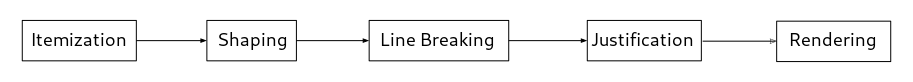

# The Rendering Pipeline

The Pango rendering pipeline takes a string of Unicode characters, converts them
it into glyphs, and renders them on some output medium. This section describes the
various stages of this pipeline and the APIs that implement them.

<picture>
  <source srcset="pipeline-dark.png" media="(prefers-color-scheme: dark)">
  
</picture>

Itemization
: breaks a piece of text into segments with consistent direction and shaping
  properties. Among other things, this determines which font to use for each
  character. Use [func@Pango.itemize] or [func@Pango.itemize_with_base_dir]
  to itemize text.

Shaping
: converts characters into glyphs. Use [func@Pango.shape],
  [func@Pango.shape_full] or [func@Pango.shape_item] to shape text.

Line Breaking
: determines where line breaks should be inserted into a sequence of glyphs.
  The functions [func@Pango.default_break], [func@Pango.tailor_break] and
  [func@Pango.attr_break] determine possible line breaks. The actual line
  breaking is done by [class@Pango.Layout].

Justification
: adjusts inter-word spacing to form lines of even length. This is done by
  [class@Pango.Layout].

Rendering
: takes a string of positioned glyphs, and renders them onto a surface.
  This is accomplished by a [class@Pango.Renderer] object. The functions
  pango_cairo_show_glyph_string() and pango_cairo_show_layout() use a
  [class@Pango.Renderer] to draw text onto a cairo surface.
